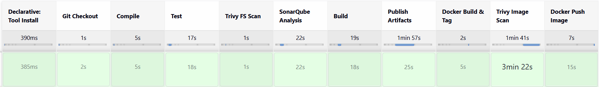
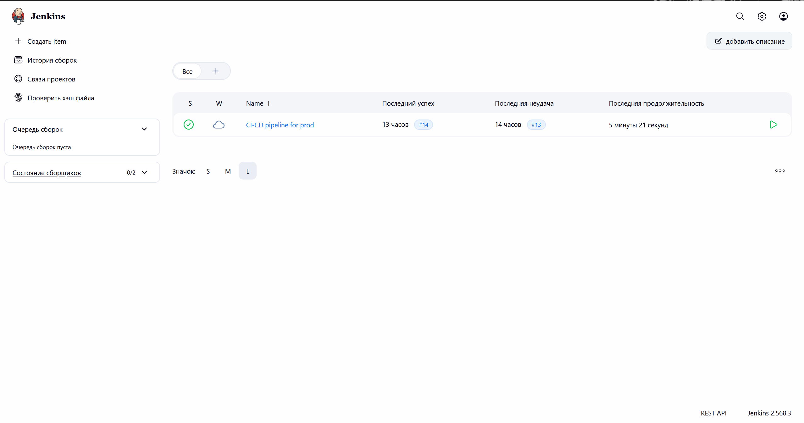
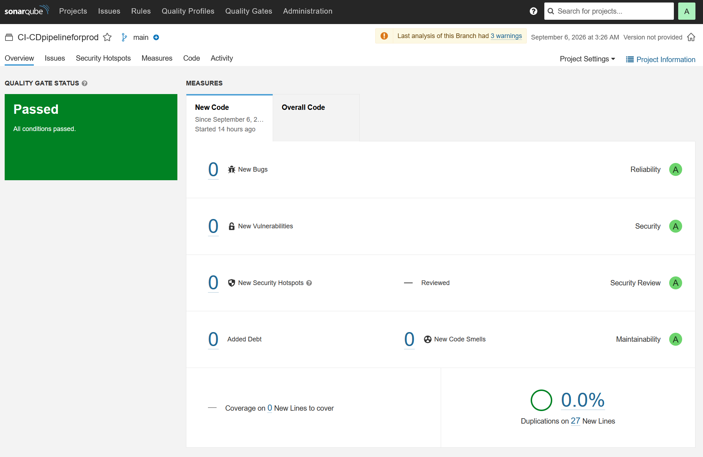
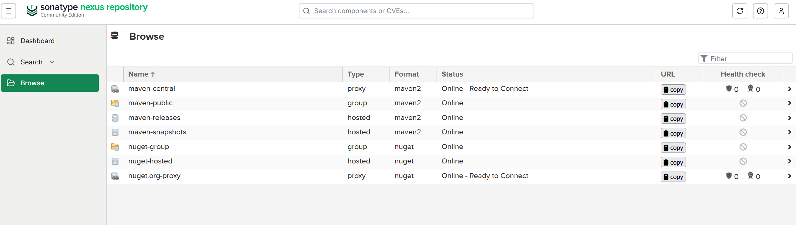
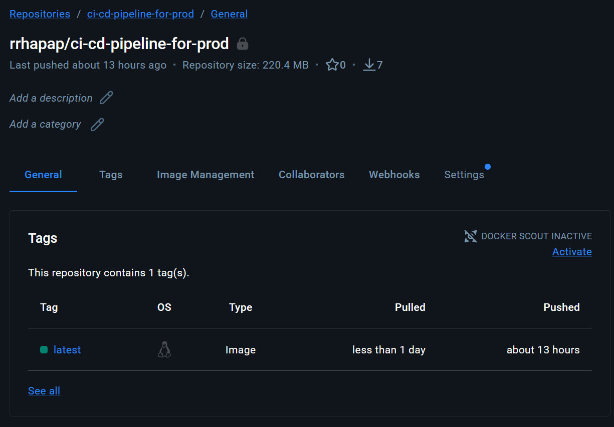

# CI/CD pipeline for production deployment

Данный проект демонстрирует работу CI/CD-pipeline (на примере небольшого веб-приложения) с использованием
Jenkins, SonarQube, Nexus, Docker и Trivy. Вся инфра поднимается локально через
Vagrant + VirtualBox, что позволяет развернуть стенд у себя на устройстве (При наличии минимальных свободных ресурсов).


## Архитектура стенда

Три виртуальные машины Ubuntu 24.04 LTS:

| ВМ         | Роль                                   | Ресурсы            |
|------------|----------------------------------------|--------------------|
| jenkins    | конвейер, сборка     				  | 2 vCPU / 4 GB RAM  |
| sonarqube  | статический анализ качества кода       | 2 vCPU / 4 GB RAM  |
| nexus      | хранилище артефактов 				  | 2 vCPU / 4 GB RAM  |


## Стадии pipeline



1. **Git Checkout** — получение исходного кода из GitHub.
2. **Compile** — компиляция проекта (Maven).
3. **Test** — запуск unit-тестов.
4. **Trivy FS Scan** — сканирование файловой системы проекта на уязвимости и наличие секретов.
5. **SonarQube Analysis** — статический анализ кода.
6. **Build** — сборка jar-файла.
7. **Publish Artifacts** — выгрузка артефакта в Nexus.
8. **Docker Build & Tag** — сборка Docker-образа приложения.
9. **Trivy Image Scan** — сканирование собранного образа на уязвимости.
10. **Docker Push Image** — публикация образа в Docker Hub.


## Как развернуть стенд 

1. Первым делом необходимо установить VirtualBox: https://www.virtualbox.org/wiki/Downloads
2. Затем установить Vagrant: https://developer.hashicorp.com/vagrant/install

```bash
git clone https://github.com/RHAPAP/CI-CD-Pipeline-for-prod.git
cd CI-CD-Pipeline-for-prod/infra
vagrant up
```

После поднятия ВМ:
1. Настроить Jenkins (Поставить плагины: SonarQube Scanner, Config File Provider, Maven Integration,
Pipeline Maven Integration, Stage Review - по усмотрению, Docker Pipeline)
 и указать инструменты: `jdk21`, `maven`, `sonar-scanner`, `docker`.
2. Настроить SonarQube: создать проект `CI-CDpipelineforprod`, сгенерировать токен доступа.
3. Подключить credentials в Jenkins: `git-cred` (GitHub), `docker-cred` (Docker Hub),
   `sonar-token` (SonarQube), а также `settings.xml` через Managed Files для Nexus.
4. Создать Pipeline job, указать Jenkinsfile из репозитория, запустить сборку.


- Инструменты (`jdk21`, `maven`, `sonar-scanner`, `docker`) подключены через Jenkins Global Tool
  Configuration, а не зашиты в скрипт — упрощает переносимость между агентами.
- Настроен собственный кеш для Trivy (`TRIVY_CACHE_DIR`) — база уязвимостей не перекачивается
  заново при каждом запуске, что ускоряет повторные сборки.
  
## Итоги работы pipeline

1. Запуск конвейера в Jenkins:


2. Проверка кода SonarQube:


3. Выгрузка артефактов в Nexus:


4. Выгрузка собранного docker образа в registry:
